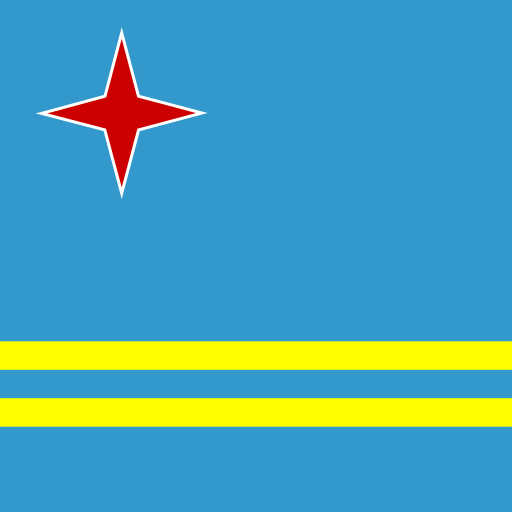
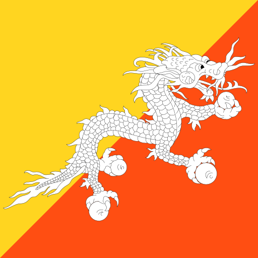

<h1 align="center">🌟 Country Flag Icons 🌟</h1>

----
 

### `❓ What's it? ❓`

> SVG icons of country flags in `1x1` and `4x3` size.

  
  
  
  
  
  
  
  
  
  

  
  
  
  
  
  
  
  
  
  

  
  
  
  
  
  
  
  
  
  

  
  
  
  
  
  
  
  
  
  

  
  
  
  
  
  
  
  
  
  

  
  
  
  
  
  
  
  
  
  

  
  
  
  
  
  
  
  
  
  

  
  
  
  
  
  
  
  
  
  

  
  
  
  
  
  
  
  
  
  

  
  
  
  
  
  
  
  
  
  

  
  
  
  
  
  
  
  
  
  

  
  
  
  
  
  
  
  
  
  

  
  
  
  
  
  
  
  
  
  

  
  
  
  
  
  
  
  
  
  

  
  
  
  
  
  
  
  
  
  

  
  
  
  
  
  
  
  
  
  

  
  
  
  
  
  
  
  
  
  

  
  
  
  
  
  
  
  
  
  

  
  
  
  
  
  
  
  
  
  

  
  
  
  
  
  
  
  
  
  

  
  
  
  
  
  
  
  
  
  

  
  
  
  
  
  
  
  
  
  

  
  
  
  
  
  
  
  
  
  

  
  
  
  
  
  
  
  
  
  

  
  
  
  
  
  
  
  
  
  

  
  
  
  
  
  
  
  
  
  

  
  
  
  
  
  
  
  
  
  

  

